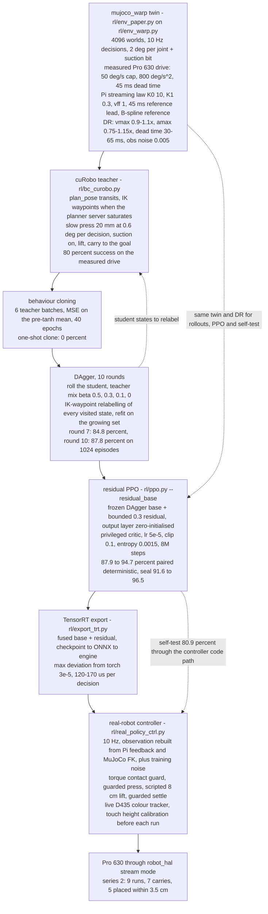
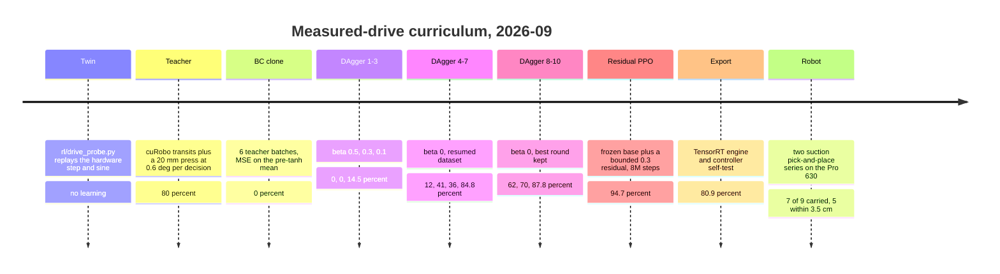

# pick_and_place — MyCobot Pro 630 suction pick-and-place, touch & hand-eye calibration

Eye-in-hand (RealSense **D405**) suction pick-and-place for the **MyCobot Pro 630** (6-DOF),
plus a vision **touch/contact** controller and the **TCP + hand-eye calibration** tooling.
Started as a self-contained kinematic **simulation** (robot off); grew into the real-robot
stack. Reuses the existing repos' cuRobo V2 motion planner, URDF, D405 intrinsics, joint
conventions and ROS2 bridge (siblings `../mycobot_mpc`, `../ros2node`).

> Env: **`curobo2`** conda env for the cuRobo planner; ROS2 Humble + system python3
> (`PYTHONPATH=~/librealsense/build/release`) for the live D405/robot scripts.

---

## Training procedure (RL, 2026-09)

The policy that picks and places on the real arm today is **not** PPO from scratch. It is a
student cloned from a cuRobo-based scripted expert, corrected by **DAgger**, then fine-tuned by a
**bounded residual PPO**, all inside the `mujoco_warp` twin running a **hardware-calibrated Pro 630
drive model**. The planner produces data only — at run time the fused network is the only thing
that runs. Every number below comes from [`rl/FINDINGS.md`](rl/FINDINGS.md) (items 1–22); the
training flags live in [`rl/README.md`](rl/README.md) and the checkpoints in
[`rl/weights/README.md`](rl/weights/README.md).

### Pipeline



In words: the twin is calibrated against the arm, the planner writes demonstrations into
it, the network is fitted to those demonstrations and then to its own mistakes, PPO adds a small
bounded correction, and the result is compiled and streamed to the Pi.

### Curriculum and schedule



| # | Stage | What is trained | Data / teacher | Objective | Steps or rounds | Metric at the end |
|---|---|---|---|---|---|---|
| 0 | Twin calibration | nothing | hardware step + sine replay (`rl/drive_probe.py`) | — | — | sim 10° step onset 60 ms / rise 0.24 s / settle 0.43 s vs hardware 36–52 ms / 0.27 s / 0.43 s; 12° 0.5 Hz sine rms 0.12° vs 0.10–0.12° |
| 1 | Scripted expert | nothing | `rl/bc_curobo.py`: cuRobo `plan_pose` transits + scripted press | — | 6 teacher batches | **80 %** teacher success on the measured drive (press-depth sweep: 4 mm 3 %, 8 mm 65 %, 12 mm 80 %, **20 mm 91 %**) |
| 2 | Behaviour cloning | actor `pi` | the teacher batches | MSE on `mu = atanh(a)` (pre-tanh space) | 40 epochs | **0 %** — the seal basin is too narrow for a one-shot clone |
| 3 | DAgger rounds 1–3 | actor `pi` | student rollouts relabelled by the teacher | same MSE on the growing set | 3 rounds, β 0.5 / 0.3 / 0.1 | **14.5 %** deterministic (`dagger4_real`) |
| 4 | DAgger rounds 4–7 | actor `pi` | `bc_curobo.py --resume`, β 0 relabels | same | 4 rounds | **84.8 %** (`dagger5_real_iter7.pt`) |
| 5 | DAgger rounds 8–10 | actor `pi` | continued rounds, keep the best-scoring one | same | 3 rounds, ≈1.4 M states | **87.8 %** on 1024 episodes (`dagger6_real_iter10.pt`) |
| 6 | Residual PPO | a second actor only | on-policy rollouts in the same twin | PPO clipped surrogate on the paper reward below; executed action `clip(base + 0.3·tanh(r))`, residual zero-initialised, critic from scratch with 5 privileged dims, 8 critic-only warm-up updates, demo anchor decaying 1.0 → 0.1 | 8 M steps, 4096 worlds, γ 0.98, 3 epochs, minibatch 24576 | **94.7 %** paired deterministic, seal 96.5 %, residual magnitude ≈0.02, no decay (`resid1_real_best.pt`) |
| 7 | Export + self-test | nothing | — | — | — | engine vs torch 3e-5; closed loop through the controller **80.9 %** vs 78 % direct |
| 8 | Real robot | nothing | — | — | 2 series, 19 runs | series 1: 5 of 10 full pick-and-place; series 2: 7 of 9 carried, **5 placed within 3.5 cm** |

The ideal-drive line is kept as a control, not as a deployment path: plain PPO with the same
recipe reaches **83.1 %** there (`paper12_ideal_best.pt`) but scores **1–2 %** in the
measured-drive env (see "why" below).

**Domain randomisation** (`--dr`, `rl/env_warp.py DRIVE_DR`):

| knob | range |
|---|---|
| drive velocity cap | 50 °/s × U(0.9, 1.1) |
| drive acceleration cap | 800 °/s² × U(0.75, 1.15) |
| command → motion dead time | U(30, 65) ms (nominal 45 ms) |
| observation noise | Gaussian σ **0.005** — also required at test time, see below |
| PD gain scale, seal tolerance | per-world jitter |
| action latency | the legacy 100 ms action-delay DR is **off** under `--drive real`; the drive model already carries the real latency |

**Reward of the paper-style env** (`rl/env_paper.py`; weights are the working recipe, the paper's
own values in brackets where they differ):

| term | form | weight |
|---|---|---|
| `reach` | `1 − tanh(d_tcp→grasp / 0.25 m)`, measured to the **grasp point** (top centre + cup radius), not the object centre | 0.5 [1] |
| `lift` | dense ramp to `h_min` = 2 cm, equal to the paper's indicator at and above it | 2 |
| `track_c` | gated on lifted, `1 − tanh(d_goal / 0.10 m)` | 4 [2] |
| `track_f` | gated on lifted, `1 − tanh(d_goal / 0.02 m)` | 8 [4] |
| `press` | dense credit for a sustained press into the top (embodiment fix: a suction cup has no "close the gripper") | 0.5 |
| `seal` | one-time latch bonus | 2 |
| `reg_act`, `reg_vel` | `−λ(t)·(‖Δa‖² + ‖q̇‖²)`, λ ramps to 0.02 | `--reg_ramp 0.4` |
| `fail` | object off the table | −1 |
| `speed` | hinge `−w · Σⱼ relu(abs(q̇ⱼ) − 30 °/s) / 30` and the same on acceleration above 400 °/s² — not in the paper, it keeps the motion inside the 36 °/s following-error ceiling | 0 by default; 0.5 / 0.2 in the speed run |
| `time` | flat cost per decision until the object is lifted **and** at the goal — makes *finishing* pay | 0 by default; on in the speed retraining |

Success = object lifted and within `--succ_tol` 3.5 cm of the goal at the 150-decision limit.

### Why the pipeline looks like this

Three negative results shaped it, and each is expensive to rediscover:

- **Plain PPO from a DAgger init decays on the measured drive.** `paper13/14_real` peaked at
  ≤ 24 % and fell back; even the demonstration anchor (`--bc_data --critic_warmup`) did not fix it.
  The on-policy updates destroy the narrow press behaviour. A *bounded, zero-initialised* residual
  cannot: training starts exactly at 87.9 % and the base is frozen.
- **Cross-drive transfer fails.** An 89.8 % ideal-drive checkpoint scores 1–2 % in the
  measured-drive env *even at zero dead time and 5× acceleration* — the streamed outer law, the
  100 ms ramps, the velocity ceiling and the delayed feedback remain. Each drive needs its own
  policy trained under its own dynamics, which is why the twin must match the drive.
- **The clone needs its training observation noise at test time.** Nominal sim, no noise: 31 %;
  with the env's 0.005 Gaussian noise: 78 %; full DR: 85 %. Deterministic observations let the
  clone stall at a fixed point. `real_policy_ctrl.py --obs_noise 0.005` is the default on the robot.

### Deployment on the real arm

Safety rules, port map and the object-height precondition are documented once in
[`rl/README.md`](rl/README.md#deploying-a-policy-on-the-real-pro-630-2026-09-19) and the bring-up
sequence in [Real robot — complete start procedure](#real-robot--complete-start-procedure) below —
they are not repeated here. In short: nothing is sent without `--exec`, the per-decision delta is
≤ 2°, the streamed reference may lead the measured joint by ≤ 3°, the elbow box and wall keep-out
are enforced on every decision, a torque contact guard holds at "firm" and aborts at "hard", and
SIGINT drops suction and stops streaming.

```bash
PY=~/miniconda3/envs/mjwarp/bin/python

# 1. export the current policy (fused base + residual) -> ONNX + TensorRT engine
$PY rl/export_trt.py rl/weights/resid1_real_best.pt --obs_dim 40 --out rl/weights/resid1_real_best

# 2. self-test the controller path against the twin (no robot, same observation code)
$PY rl/real_policy_ctrl.py --policy rl/weights/resid1_real_best --selftest --episodes 16

# 3. live object tracker on the fixed D435 (Lab distance from the table colour) -> UDP :9701
PYTHONPATH=~/librealsense/build/release python3 rl/rgb_track.py --mode diff --top 0.098

# 4. one pick-and-place run: tracker xy, touch height calibration, random goal
bash rl/run_pick.sh 01              # or: bash rl/run_pick.sh 01 <goal_x> <goal_y>
```

`rl/run_pick.sh` reads the tracker, subtracts the measured tracker bias
(`~/pnp_rl/tracker_bias.json`, +0.7 / −16.9 mm), picks a goal, then runs
`real_policy_ctrl.py --track --touch_calib --go_home --exec` and asks the success monitor on
UDP :9702 for a verdict. Controller behaviour that the two robot series forced in (all in
`rl/real_policy_ctrl.py`, FINDINGS 20–22):

- **guarded press** — vertical 2 cm/s until the contact metric reaches 0.11, never more than 15 mm
  below the calibrated top, then a 0.5 s dwell with suction on;
- **touch height calibration** before every run — camera tops read 1–6 cm low on cups;
- **attach** = contact for `ATTACH_AFTER` with suction on, by torque **or** by position **or** by
  lift-after-press, followed by a **scripted 8 cm lift** (the policy's post-attach press is
  unreliable off its trained height);
- **tracking frozen** once the cup is within 15 cm vertically — the arm's shadow shifts the blob;
- **flat hold chunks**, a carry-phase action filter for the 5 Hz dither, a **guarded settle**
  before release, and always retract + home;
- all scripted legs are **min-jerk** paths at a 25 °/s peak that wait on feedback instead of a
  blind pad, with a `[timeline]` line and a `.phases.json` written per run (35–45 s runs should
  land at 20–25 s; the policy itself is ~8 s of that).

### Results on the robot, 2026-09-20

| series | runs | outcome |
|---|---|---|
| touch-only demos | 6 | touch at 5.1 s at full training speed, 3.9 s on a 10 cm object outside the trained 2–7 cm range, 6.1 s at x = 0.26 near the base — generalises in height and position without retraining |
| suction series 1 | 10 | **5 full pick-and-place**, placed 1.0–5.5 cm from the goal; failures were controller shakedown, a sloped top and a 2 cm thin object |
| suction series 2 | 9 | **7 carries, 5 placed within 3.5 cm**, 2 set down ~6 cm off, 1 tipped on release before the guarded settle existed; 2 failures on an open-top cup |

Known hardware nuisances from these sessions: the Pi's `:9999` feedback broadcaster died silently
four times (command port `:9998` kept answering) — relaunch the stack; and after one relaunch
joint 6 stopped responding with status word 0x8637, the August "deaf drive" signature.

### What is next

- **IL v2 — planned, nothing built yet** ([`policy/PLAN_IL_V2_CUROBO_WARP.md`](policy/PLAN_IL_V2_CUROBO_WARP.md)):
  diverse objects, a cell with walls and 0–3 distractors, a batched cuRobo v3 expert with TOPP-RA
  retiming, and DP / CFM / ACT / BC heads over 1.5 s B-spline chunks, evaluated closed-loop in warp.
- **env v2 DAgger plateau** — `rl/env_v2.py` `DiverseEnv` (47-D obs, shapes box/cyl/hex): teacher
  only ~50 % (box 63 / cyl 50 / hex 37), student plateaus around **46 %** at rounds 10–16
  (`~/pnp_rl/dagger_v2c`). The ceiling is the teacher, so the press-rate sweep has to be redone there.
- **Speed retraining, in progress** — the policies still peak at ~61 °/s in the twin. `resid2_speed`
  added the speed and acceleration hinges (`--w_speed 0.5 --w_acc 0.2 --v_soft 30 --a_soft 400`) and
  held ~89 % without trimming the peaks; the run going in today is a residual on a **3° action bound**
  (`--dq_max 3` with `--base_scale 0.667`) plus the **time penalty** `--w_time`.
- **Two-camera success monitor** — `rl/success_monitor.py` judges a run from the two idle D405s
  (before/after Lab diff, 3-D on the fixed camera, a live-fitted homography on the wrist camera).
  The controller's own D435 verdict is unreliable as soon as a second object is in view.

---

## System / stack

```
 Desktop (this repo)                                  Raspberry Pi  (LinuxCNC)
 ┌──────────────────────────────────────┐             ┌───────────────────────────┐
 │ pick_and_place/  (detect·grasp·touch· │  /mycobot/  │ robot_hal.py              │
 │                   calibrate)          │  cmd/move   │  PID / inv-dyn controller │
 │     │  planner RPC :9997 (cuRobo V2)  │ ───────────▶│  B-spline trajectory      │
 │     │  perturb_loop.execute / state   │ /joint_     │  follower (~0.8 s lag)    │
 │     │  mycobot_ros2_bridge ───────────┤◀─ states ──┤  cmd:9998  stream:9999    │
 │     │  SAM3 :5599                     │             │  HAL pin pro600.digital_  │
 │     ▼  D405  (USB, eye-in-hand)       │             │  out00  → suction valve   │
 └──────────────────────────────────────┘             └───────────────────────────┘
   camera pose in base = FK_tcp(q) @ T_TCP_CAM   (TCP = 0.145 m suction tip, see Calibration)
```

---

## Streaming control (online, 4 ms) + touch methods

The per-command follower (~0.8 s dead-time, above) is superseded by an **online streaming**
path that drives the arm at **4 ms (250 Hz)** from cuRobo trajectory chunks, plus a set of
**touch / contact** methods. Full detail in **[TOUCH_METHODS.md](TOUCH_METHODS.md)**.

```
cuRobo planner (:9997) ── plan full traj, slice 0.4 s chunk every 0.1 s (sliding window)
  online_planner_node.py ── /planner/weld_chunks ──▶ chunk_to_pi.py ──▶ Pi :9994
  online_servo.py (Pi, 250 Hz): welds chunks → q_ref(t); target = q_ref(now+lead)
    (feed-forward lead cancels the constant dead-time) + pure-PD.  Feedback on :9999.
```

**Touch methods** — `servo_touch.py --stream`:
- `--open-touch` — open-loop descend to the detected top; the compliant cup presses. **Reliable** (controller tracks to ~1 mm).
- `--torque-stop` — joint-torque rise (`pro600.joint{i}_torqfb`, now in the `:9999` stream).
- `--gap-stop` / `--ring-px` / `--gap-descend` — depth gap; **proximity only** (fires ~+41 mm above wide tops).

> **Key finding:** depth/vision contact-sensing is impossible here — the suction cup sits in
> the D405 near-field blind spot, so its own depth is unmeasurable. Use open-loop or torque.

`touch_chunk.py` + `plot_touch_chunk.py` run touch+return via the chunk path and record an
mcap rosbag + D405/D435 frames + phase/contact, then plot trajectory/phase/contact/RGB.
`step_response.py` measures the end-to-end dead-time.

---

## A. Real pick-and-place

Clear flat tabletop objects into a 25 cm bin, one by one. `real_multi.py` does one object
per call; `real_pipeline.py` loops all objects **and records** the run.

```
 base pose
   │
   ├─ DETECT objects  ── D405 RGBD + SAM3 "everything" → base-frame clouds
   │                     filter: reachable, ≤0.13 m tall, not the bin, dedup
   │
   └─ for each object ▸
        pre-grasp 6 cm above flat-top centre   (3 cm-flat support → tolerant to ~1 cm error)
          → REFINE grasp from a close top-down capture (low-noise)
          → suction ON  → descend-to-contact (depth gap at the cup tip, floor-limited)
          → LIFT  → VERIFY held (depth right at the suction tip)
          → PLACE: object-centroid centred over the bin, released ABOVE the rim → drops in
          → back to base
```

`real_pipeline.py` additionally streams, per object, **30 Hz RGB + joint angles + suction
state + timestamps** (`obj_NN/frames/*.jpg` + `states.jsonl` + `events.jsonl`), window =
base → release.

```bash
source /opt/ros/humble/setup.bash
PYTHONPATH=~/librealsense/build/release python3 pick_and_place/real_pipeline.py \
    --suction-host 10.0.0.27 --max-objects 8
# single object / by name:
python3 pick_and_place/real_multi.py --target "orange juice carton" --near 0.45,0.07 \
    --suction-host 10.0.0.27
```

---

## B. Welded touch + blue-dot pick-and-place (`servo_touch.py`)

The main real-robot controller. Every phase is **velocity-continuous** ("welded") — the robot
never decelerates to rest between phases except the suction-seal dwell. Contact is detected by
a **blue marker dot** on the cup's spring-loaded plunger, which physically rises when the cup
touches an object (tracked by normalized template matching, robust to shadow).

```
 base → ONE welded descent: current → pregrasp (passed at NON-ZERO velocity, no stop)
      │   → fast descent → slow last stretch → decel-to-rest at the detected surface
      → CONTACT = blue-dot plunger rises ≥ thresh (re-baselined at gate-open; gap is log-only)
   [pick-and-place mode]
      → grasp-press (settle, then press from rest to seal) → SUCTION ON → seal dwell  ← only v=0
      → WELDED carry: lift the object CLEAR of the box rim → over the box → release above rim
      │   (collision-aware: transit z = rim + clearance + object-hang, so the carried object
      │    can't clip the box; the planner has no runtime attach, so this is geometric routing)
      → WELDED return to base
```

**Hard-won constraints** (see memory `real-touch-controller.md` / `next-welded-trajectories.md`):
- ~0.8 s follow-lag → a vision-HOLD on a *fast* descent overshoots; the welded descent is
  fast then **slows to ~2 °/s in the last stretch** so the blue-dot HOLD is gentle.
- cuRobo plans **rest-to-rest** & is **torque-aware** — welds are post-hoc re-timed to a
  non-zero junction velocity, and the lift/return/carry are **capped to cuRobo's native peak**
  (forcing a flat 55 °/s races motor-cmd past feedback → following-error power-off; ~20 °/s is
  the torque-feasible ceiling lifting against gravity).
- the **gap under-reads / false-fires** near contact → blue-dot is the only contact trigger.

```bash
# touch only (records joints+RGBD with --record; plot with plot_touch.py)
PYTHONPATH=~/librealsense/build/release python3 pick_and_place/servo_touch.py --record
# full welded pick-and-place of every object into the bin at [0.1,0.4]
python3 pick_and_place/servo_touch.py --pick-place --max-objects 10 --max-foot 0.25 \
    --suction-host 10.0.0.27
# segment the blue marker dot first (once): writes outputs/blue_dot_mask.npz
python3 pick_and_place/blue_dot_mask.py
```

---

## C. Calibration

```
 TCP length      floor touch-test (base on table, base_link z=0):
                 cup tip is 0.145 m below the flange  →  URDF tcp_joint, config.PLANNER_TCP_LEN
                 (the 0.13 m it had made every grasp dive ~1.5 cm too deep)
                 ⇒ CAM_TCP_Z_SHIFT = 0  (tcp == the hand-eye calib frame)

 Hand-eye        calib_handeye.py:  base + JOINT-SPACE board views (sample J4/J5/J6 within the
 (T_TCP_CAM)     natural-elbow ranges, |J6|≤95° so the eye-in-hand cable can't drop the USB) →
                 detect ChArUco → pair FK(tcp) with board-in-cam → cv2.calibrateHandEye

 Validate        aruco_touch.py  — touch each ArUco marker at its detected base position
                 touch_objects.py — touch real object centres
```

```bash
PYTHONPATH=~/librealsense/build/release python3 pick_and_place/calib_handeye.py \
    --target 0.4,0,0.0 --square 0.035 --marker 0.026          # writes outputs/handeye_*.json
python3 pick_and_place/aruco_touch.py --max-markers 6        # validation
```

---

## D. Simulation (robot off)

Kinematic + geometric sim of the whole pick-and-place, rendered from the URDF — no ROS,
no hardware. `run_demo.py`; MuJoCo replay via `run_mujoco.sh`.

```
 base → render eye-in-hand RGBD → segment → deproject → cloud (+normals)
      → DETECT 1 cm circular suction grasp point + object 3D OBB
      → PICK (pre-grasp▸descend▸suction▸lift)
      → PLACE  segmented (waypoints)  |  planned (collision-free, OBB as collision volume)
      → release → EVALUATE → report.json/txt + demo.mp4/gif
```

```bash
conda activate curobo2 && cd /home/lisc-frank/Desktop/2026
python -m pick_and_place.run_demo --place-mode planned        # or segmented
bash pick_and_place/run_mujoco.sh planned iso                 # MuJoCo render
```

Sim evaluation PASS = all six: detection · reachability · seal · collision_free ·
released_above_rim · placed.

---

## Modules

| file | role |
|---|---|
| `config.py` | paths, **`T_TCP_CAM`**, intrinsics, TCP/standoff params, base pose, scene defaults |
| `geometry.py` | pose / wxyz-quaternion / transform helpers |
| **real robot** | |
| `real_pipeline.py` | detect-all → pick&place loop, **records 30 Hz RGB+joints+suction** |
| `real_multi.py` | one object per run; `--target`/`--near` for by-name picks; detect/grasp/place |
| `real_grasp.py` | single suction pick (no place); 1 cm suction-point detector; online viewpoint |
| `real_place.py` | place a held object into the bin (carried-OBB verified clear) |
| `robot_execute.py` | replay an exported trajectory on the Pi via the ROS2 bridge |
| `suction_test.py` | toggle the suction HAL pin (`pro600.digital_out00`), no motion |
| **touch / calibration** | |
| `touch_objects.py` | welded approach → touch object centres (no suction) |
| **`servo_touch.py`** | **welded touch + blue-dot contact + suction pick-and-place** (weld descent/return/carry, torque-feasible, collision-aware place); `GapMonitor` streams gap + plunger-dot template |
| `blue_dot_mask.py` | segment the blue plunger marker below the cup dome (contact-signal ROI) |
| `plot_touch.py` | joint pos/vel profiles + time-aligned RGBD filmstrip for a recorded episode |
| `servo_diag.py` | gap-vs-distance diagnostic at several annulus offsets/heights |
| `calib_handeye.py` | eye-in-hand `T_TCP_CAM` recalibration (ChArUco + `calibrateHandEye`) |
| `aruco_touch.py` | hand-eye validation: touch each detected ArUco marker |
| **simulation** | |
| `sim_planner.py` · `scene.py` · `perception.py` · `grasp_detection.py` · `obb.py` · `collision.py` · `simulator.py` · `pipeline.py` · `evaluate.py` · `run_demo.py` · `mujoco_export.py` · `mujoco_play.py` | the in-process sim + MuJoCo render |

## Key facts / caveats

- **TCP = 0.145 m** (suction tip below flange); `CAM_TCP_Z_SHIFT = 0`. Restart the cuRobo
  planner after any URDF tcp edit.
- **Controller follow-lag ~0.8 s** → never vision-HOLD a moving descent; descend to a
  pre-computed target and let cuRobo decelerate to rest there.
- **Surface estimates are ±~1 cm**; the **dome-arc gap under-reads** in the final ~1.5 cm.
  The soft cup's **~1 cm spring** is the only compliance (no F/T or vacuum feedback).
- **Cup contact ROI** = `outputs/cup_mask.npz` (cup is rigid to the camera ⇒ valid at every
  pose): cup mask, black-dome submask, and a top-curve monitoring ring.
- D405 **USB cable** can drop off the bus during arm motion (eye-in-hand) — needs reseat;
  large wrist swings make it worse (hence the J6 limit in calibration).
- `outputs/` (debug images, calibration JSON, recordings) is **git-ignored**.
```

---

## Controllers & sim twin (2026-08)

Three control stacks, all validated on the MuJoCo twin (`rl/scenes/*.xml`,
same model the RL trains on) with an emulated drive layer that reproduces the
real arm's velocity-mode servo behavior. Environment for all sim scripts:
the `mjwarp` conda env (`$PY = ~/miniconda3/envs/mjwarp/bin/python`).

| Script | What it runs |
|---|---|
| `sim_taskmpc.py` | closed-loop task-space MPC demo: 50 Hz QP (position + cup-vertical orientation task, wall constraint, joint limits) → 250 Hz LQR → drives; moving-object tracking, contact stop, renders mp4 + cmd-vs-actual plots |
| `compare_controllers.py` | cuRobo-v2 vs task-MPC vs pseudo-inverse on a touch task; `--trials N` randomized scenes, RMSE/time/tilt metrics |
| `pick_place_compare.py` | FULL pick-and-place in clutter (suction weld, carried-volume-aware placement, contact release); hybrid cuRobo = plan transits / servo contacts |
| `rl/eval_bench.py` | RL-policy benchmark ladder (see `rl/README.md`) |

```bash
$PY sim_taskmpc.py --out ~/pnp_rl/taskmpc          # demo + video + plots
$PY compare_controllers.py --trials 100 --workers 6
$PY pick_place_compare.py --trials 30 --workers 6 --only taskmpc
# cuRobo variants need the planner server (curobo2 env) on :9997:
cd ../frankkimrobotics/ros2_mycobot/src/mycobot_description/curobo && \
  ~/miniconda3/envs/curobo2/bin/python curobo_planner_server_v2.py
```

Headline results (30 randomized cluttered scenes each): task-MPC 100%
(10.7 s, 0.5 cm), hybrid cuRobo 100% (19.6 s, 0.8 cm), pinv 20%.
Key rules encoded in the harnesses: reference rate strictly below the layer
beneath; anti-windup clamp to measured state; joint POSITION limits +
nullspace limit-avoidance in the task layer; planners only for free-space
transits (near-contact plan failures compound); seal welds at the CURRENT
relative pose (latch-jolt); scale dq UNIFORMLY, never clip per joint (a
per-joint box bends the task direction as its active set flips -> ~5 Hz
visible chatter; verified by band-split FFT of tcp accel — raw jerk metrics
are dominated by invisible >12.5 Hz content) and rate-limit descent strokes
(z <= 8 mm/tick) so the scaler never starves the xy correction.

Extras: `render_mpc_demo.py --ctrl {taskmpc,lagmpcN,pinv,curobo}` renders
any controller on a chosen scene (`--seed0`); `lagmpcN` = explicit
lag-aware MPC inner loop (N=25 prediction steps @ 4 ms) executing N ticks
open-loop before re-solving — exec sweep on one scene: 1 -> 12.1 s,
2 -> 15.1 s, 8 -> 73.7 s (stale plans dominate, not horizon softness).

## BC-mystery replication (`bc_mystery/`, 2026-08)

Replication harness for seohong.me/blog/behavioral-cloning-mystery on the
batched mujoco_warp PickEnv (training deferred; see `bc_mystery/PLAN.md`):

```bash
$PY bc_mystery/collect.py --episodes 2048 --out ~/pnp_bc/shard0  # demos
$PY bc_mystery/evaluate.py --policy expert                       # anchors
$PY bc_mystery/render_demo.py --episodes 6                       # video
```

`collect.py` = randomized Catmull-Rom spline expert (waypoint/speed/
suction jitter) tracked by batched DLS with event gates (pin-until-sealed
press, lift gate mid-transit, rest-height release). Expert: seal ~90%,
V1=V2=V3 ~53%, d_p50 1.4 cm on the eval_bench ladder. `evaluate.py` =
closed-loop harness, pluggable `act(obs[N,37]) -> [N,K,7]`, chunk/exec/
history knobs, offline action-MSE probe (zero policy: half of random's
MSE, same 0% success — Mystery 1 visible before any training).

---

## Real robot — complete start procedure

Hardware chain: desktop ⇄ Raspberry Pi (`pi@10.0.0.27`, or Tailscale
`100.124.53.41`; password `elephant`) ⇄ LinuxCNC + `robot_hal.py` ⇄ STM32
drives. RoboFlow touchscreen login: Admin / `elephant`.

### 1. Power & hardware start
1. Flip the robot's main power switch.
2. **Press the START button on the base** and wait for the servo *click*
   (drive relay). Without it the STM32 never reports `svr_poweroned` and no
   software can move the arm.
3. The Pi boots with the stock RoboFlow stack auto-started — it must be
   stopped before launching ours.

### 2. Launch the control stack (on the Pi)
```bash
ssh pi@10.0.0.27                      # password: elephant
# stop the stock stack + clear stale state (REQUIRED before every launch):
pkill -9 -f RoboFlow; pkill -9 -f linuxcnc; pkill -9 milltask; pkill -9 rtapi_app
rm -f /tmp/linuxcnc.lock
cd ~/Desktop/mpc
linuxcnc elerob.ini                   # GUI variant (robot monitor), or:
linuxcnc elerob_headless.ini          # headless (linuxcncrsh on :5007)
```
`robot_hal.py` is auto-loaded by the HAL file and **self-initializes
everything**: drive power-on → motor init (watch for "joint 1..6 init
success") → servo enable → machine-on → command preload → "Waiting for
commands". Ports: `:9998` command (`{"target_deg":[6 lcnc deg],
"duration":s,"controller":"pid|mpc|pd_velff"}`), `:9999` 100 Hz state
stream (joints + torque). Headless variant additionally needs homing:
`set home -1` via linuxcncrsh `:5007`.

robot_hal includes the **idle hold mode** (re-servos the last target at
idle; without it the arm sags ~0.4°/s and the drives ferror-trip) and the
**lag-aware LQR `mpc` controller** (sim-tuned, zero overshoot — see
`../mycobot_mpc/README.md`).

### 3. Verify before ANY motion (from the desktop)
```bash
# probe: 1 deg on J1, confirm the stream actually moves
python3 - <<'PY'
import socket, json, time
q = json.loads(socket.create_connection(("10.0.0.27",9999),3).makefile().readline())["joints_deg"]
t = list(q); t[0] += 1.0
s = socket.create_connection(("10.0.0.27",9998),3)
s.sendall((json.dumps({"target_deg":t,"duration":2.0,"controller":"pid"})+"\n").encode())
time.sleep(3)
q2 = json.loads(socket.create_connection(("10.0.0.27",9999),3).makefile().readline())["joints_deg"]
print("moved:", round(q2[0]-q[0],2), "deg  ->", "OK" if abs(q2[0]-q[0])>0.4 else "NOT MOVING")
PY
```
**Never send large motions to an unverified stack** — commands to frozen
drives wind the PID integral into a violent-jump hazard.

### 4. Run the hardware scripts (desktop)
```bash
# cuRobo planner (desktop GPU) — needed by real_touch:
cd ../frankkimrobotics/.../curobo && ~/miniconda3/envs/curobo2/bin/python curobo_planner_server_v2.py &

python3 real_touch.py                          # dry-run plan (touch demo)
python3 real_touch.py --exec --obj X,Y,TOPZ    # execute (slow, logged, plotted)
python3 real_ctrl_validate.py --exec           # pid-vs-mpc validation protocol
PYTHONPATH=~/librealsense/build/release python3 policy/rs_shm_server.py &   # cameras
~/miniconda3/envs/mjwarp/bin/python policy/real_student.py --exec --slow 3  # vision policy
```

### 5. Shutdown
Send the arm home, then either Ctrl-C the interactive linuxcnc (robot_hal
powers the drives off cleanly) or `pkill -f linuxcnc`, then switch off the
base. **Do not leave the arm enabled and unattended raised**: the servo
enable is known to drop spontaneously (suspected 48 V path, inspection
pending) and the arm sags until the brakes catch.

### Known hardware caveats (2026-08)
* Servo-enable hold-time degrades across soft restarts; a full power cycle
  resets it. Time-box sessions.
* Fixed D435 mount was rebuilt — **re-run `calib_d435.py` before trusting
  detections** (`d435_detect.py --board` self-check).
* Drive velocity ceiling ≈ 36 °/s (STM32 firmware) — all controllers and
  cuRobo joint-velocity limits must respect it.
