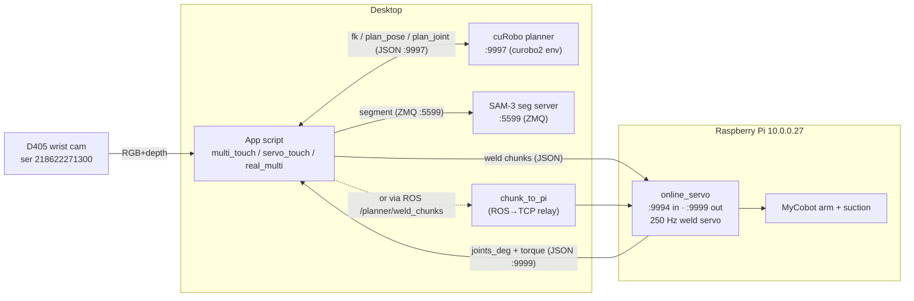
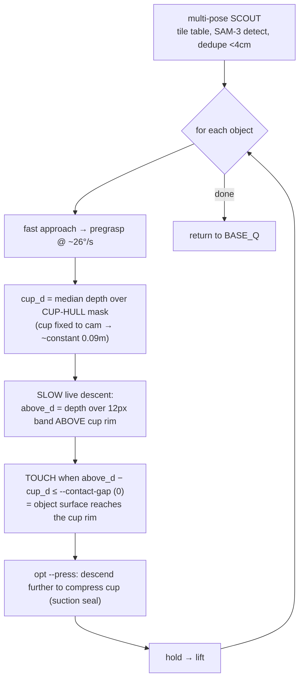
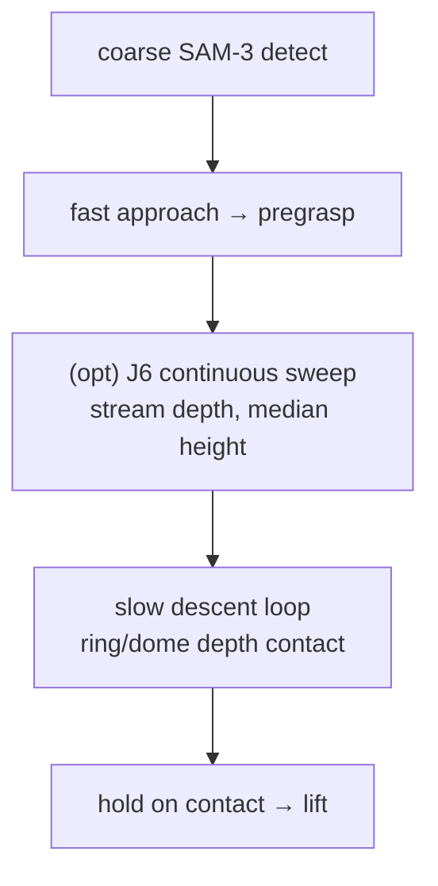
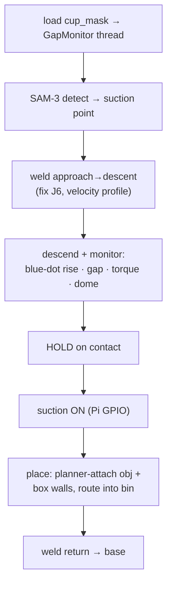
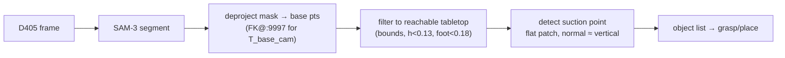
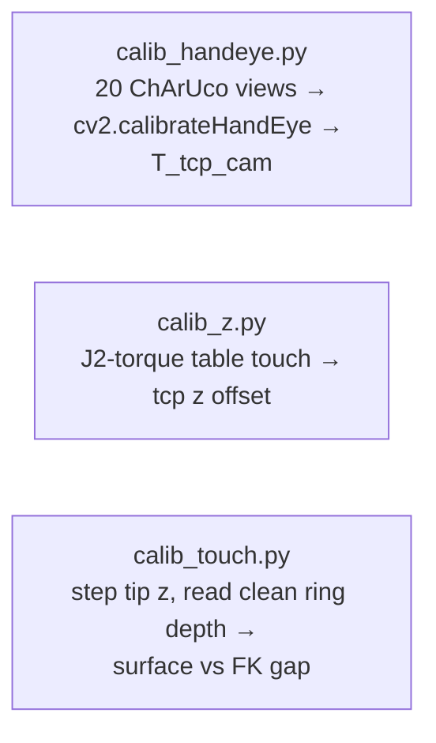

# MyCobot Pro 630 — Pick-and-Place / Touch System Overview

Interactive reference for the scripts in `pick_and_place/`. Diagrams are **mermaid** block
diagrams (render in GitHub / VS Code / Obsidian). Collapsible `▸` sections hold per-script detail.

Robot: MyCobot Pro 630 (6-DOF) · suction cup on wrist · eye-in-hand **D405** · **cuRobo** planner
on desktop · **LinuxCNC** streaming servo on a Raspberry Pi (10.0.0.27).

---

## 1. System architecture



### Ports / sockets

| Port | Host | Dir | Payload | Purpose |
|------|------|-----|---------|---------|
| **9997** | desktop 127.0.0.1 | req/resp | JSON lines | cuRobo planner: `fk`, `plan_pose`, `plan_joint`, `set_world`, `attach` |
| **9994** | Pi 10.0.0.27 | ingress | JSON lines | online_servo **chunk intake** `{trajectory, traj_dt, t_anchor}` |
| **9999** | Pi 10.0.0.27 | egress | JSON lines | online_servo **feedback** `{joints_deg, torque}` (~50 Hz) |
| **5599** | desktop 127.0.0.1 | req/resp | ZMQ | SAM-3 segmentation |
| ROS `/planner/weld_chunks` | — | pub→sub | String(JSON) | alt path: app→`chunk_to_pi`→:9994 |

> Two command paths to the arm: **direct** `send_chunk → :9994` (used by `multi_touch`, `calib_touch`, `visual_servo_touch`) and **ROS** `/planner/weld_chunks → chunk_to_pi → :9994` (used by `servo_touch --stream`). `:9998` is dead (old bridge).

---

## 2. Calibration in `config.py` (single source of truth)

| Constant | Value | Meaning |
|----------|-------|---------|
| `T_TCP_CAM` | 4×4 | wrist-D405 pose in the cup-tip (tcp) frame — hand-eye (recal 2026-07-03, spread 6.0 mm) |
| `PLANNER_TCP_LEN` | 0.135 m | tcp length in URDF/planner |
| `HANDEYE_TCP_LEN` | 0.145 m | tcp length when hand-eye was solved |
| `CAM_TCP_Z_SHIFT` | 0.010 m | corrects `fk@T_tcp_cam` for the tcp-length change |
| `BASE_Q` | `[0,-0.349,1.396,0.175,-1.571,0]` rad | rest/base pose |
| table z | −0.10 m | tabletop in base frame |

> ⚠️ **Known stale calibration (2026-07-03):** the physical cup tip is **~19 mm above** the FK tip (cup compressed past the 0.135 model). `multi_touch` compensates with `--descend-below 0.019`; the proper fix is re-shortening `PLANNER_TCP_LEN`.

---

## 3. Calibrated multi-object touch — `multi_touch.py`  ⭐ (current best)

Scans the table from several wrist-cam viewpoints, then touches each object's **center** gently
using a **DEPTH-BASED cup-region contact** — no torque, no per-object height guess, and **no
TCP-offset dependence** (SAM-3 is used only for the coarse scan).



**The cup-region** (`cup_region.py`, fixed masks in `outputs/cup_region_fixed.npz`):
- **cup** = convex hull of NEAR(depth<0.20 m)+DARK(V<95) pixels in the bottom-center = the black
  rubber dome to its rim (depth-robust, lighting-independent). `cup_d` = median depth over it (~0.09 m).
- **above** = 12 px band directly above the hull = the object-approach zone. `above_d` = median depth over it.
- **Contact = depth only:** `above_d` falls to `cup_d` as the object reaches the rim → fires at gap≈0
  (calibrated just-touch). The camera compares object-vs-cup directly, so the ~19 mm TCP offset never enters.

**Why depth, not torque** — validated 2026-07-04 (`table_touch_compare.py`, 5 random bare-table points):
**depth fired 5/5, σ = 0.5 mm; torque fired 2/5 and only after ~12 mm of press** (the soft suction cup
absorbs force → J2 torque barely rises). So torque contact is late + flaky on a suction cup; **depth is
the canonical contact detector**, with torque kept only as a hard-press safety-stop.

<details><summary>▸ args & internals</summary>

- `--contact-gap 0` (just-touch), `--press <m>` (suction seal), `--step 0.004`, `--v-touch 2.5`,
  `--abs-floor -0.03`, `--scouts "x,y,z;…"` (6-pose tile). J6 held at base in `stream_to` (§7).
- `cup_region.read_depths(depth,cup,above) → (cup_d, surf_d)`; rebuild via `build_cup_region(bgr,depth)`.
- Ports: `:9997` plan, `:9994` chunk, `:9999` joints+torque. Direct sockets (no chunk_to_pi).
- **Validated:** 4 objects (tops 0.058–0.113 m) touched at gap≈0, each at its own surface (FK z 0.051–0.094).
</details>

> **Bare-table touch** (no object): `table_touch.py` (random or `--xy` point → depth contact →
> `--press` ~1 cm → torque safety-stop) and `table_touch_compare.py` (5 points, logs depth vs torque
> contact FK-z). Both reuse `cup_region`, depth-only.

---

## 4. Vision-servo touch — `visual_servo_touch.py`

Single object. Fast approach, optional **J6-orbit height sweep**, then a slow descent. Earlier
iteration of the touch logic; `multi_touch` supersedes the contact model.



<details><summary>▸ notes</summary>

- Contact evolved: torque → depth-top → **ring-depth vs constant cup-tip plane (0.109 m)** +
  dome-compression. Ring-rim GAP proved too noisy for cup-sized objects (rim mask sees the surface, not the tip).
- `--j6-span/--j6-dur` continuous sweep = the robust height idea (median rejects cup-occluded azimuths).
</details>

---

## 5. Welded touch / pick-place — `servo_touch.py`

The heavyweight app: welds approach→descent into **one continuous trajectory** (non-zero junction
velocity, no dead-stop), multi-modal contact, optional suction + place-in-box.



<details><summary>▸ notes</summary>

- Streams via ROS `/planner/weld_chunks` → `chunk_to_pi` → `:9994` (needs `--stream`).
- `ContactDetector` (contact_detector.py): armed-then-confirm FSM fusing torque/vision/gap.
- Place fails sometimes on reachability (bin corner). 100+ tunable args.
</details>

---

## 6. Perception & pick-place — `real_multi.py` / `real_pipeline.py`



- `real_multi.py`: one object → grasp → carry → place → verify (native cuRobo, no weld).
- `real_pipeline.py`: loops many objects, **records** `outputs/obj_NN/{frames,states.jsonl,events.jsonl}`.

---

## 7. Calibration scripts



| Script | Finds | Method |
|--------|-------|--------|
| `calib_handeye.py` | `T_TCP_CAM` | diverse joint poses of a fixed 5×7 ChArUco, DANIILIDIS |
| `calib_z.py` | tcp length offset | slow descend, J2 shoulder-torque first-touch |
| `calib_touch.py` | contact-gap | hold tip at z, prints `cup_d`/`above_d`/gap to calibrate `--contact-gap` |
| `calib_fixed_static.py` | D435 / fixed-D405 extrinsics | static ChArUco at a **measured** base position → **0.1–0.75 mm** spread |
| `multi_cam_calib.py` | wrist hand-eye + 2 fixed cams | move→capture 3 cams→`calibrateHandEye(PARK)`→localize boards→fixed cams; from **randomly-placed** boards |
| `plot_masks.py` | (viz) cup/rim/ring/dome + offset ring → `outputs/cup_masks.png` |

> **Finalized extrinsics → `outputs/extrinsics_final.json`** (chose the more-accurate source per camera):
> **wrist** = `config.T_TCP_CAM` (eye-in-hand); **both fixed cams** = the `calib_fixed_static` measured-board
> result. The `multi_cam_calib` random-board method is elegant but **FK-anchored** → capped by the arm's
> kinematics (~50 mm for fixed cams vs 0.1 mm measured), so it was **rejected** for the fixed cams. Board
> generation (3 extra dicts, A4/Letter PDFs) in `outputs/calib_boards/`.

> ⚠️ **`--j6-zero` does NOT work yet.** Nudging the goal yaw makes cuRobo **jump IK branches**
> (J6 bounced 98°→−162°→34°→69°→137°→−85°). J6=0 needs a **joint-lock / branch-select in the
> planner** — see the next-session todo (cuRobo excessive-rotation item).

---

## 8. Startup (real robot)

```bash
# Desktop
conda activate curobo2 && python curobo_planner_server_v2.py     # :9997
python3 sam3_server.py --port 5599                               # :5599 (if using SAM-3)
# Pi (via HAL): online_servo.py  → :9994 chunks in, :9999 feedback out

# then, e.g.
source /opt/ros/humble/setup.bash
python3 pick_and_place/multi_touch.py        # scout + calibrated center-touch of every object
```

*Generated 2026-07-03 from a full script survey. Regenerate diagrams after major pipeline changes.*
