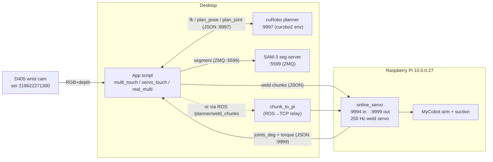
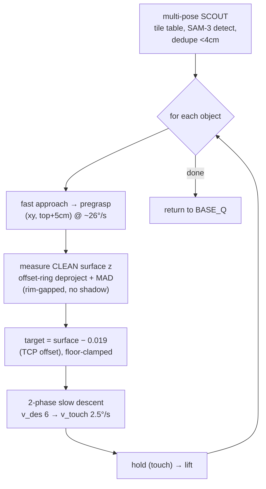
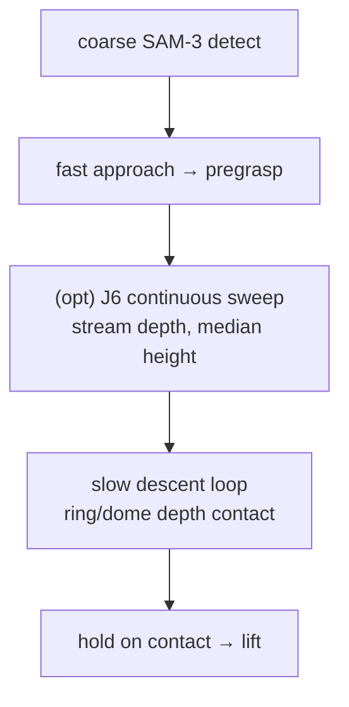
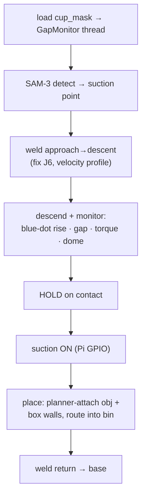
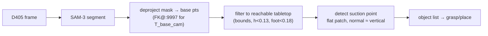
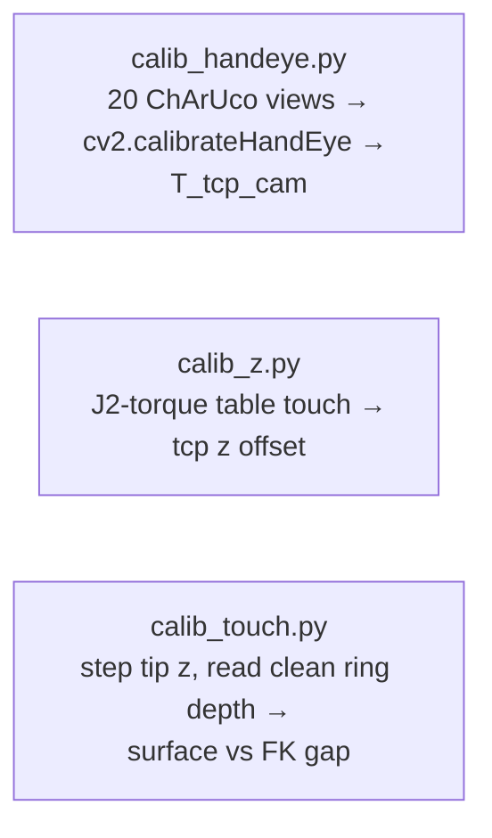

# MyCobot Pro 630 — Pick-and-Place / Touch System Overview

Interactive reference for the scripts in `pick_and_place/`. Diagrams are **mermaid** block
diagrams (render in GitHub / VS Code / Obsidian). Collapsible `▸` sections hold per-script detail.

Robot: MyCobot Pro 630 (6-DOF) · suction cup on wrist · eye-in-hand **D405** · **cuRobo** planner
on desktop · **LinuxCNC** streaming servo on a Raspberry Pi (10.0.0.27).

---

## 1. System architecture



### Ports / sockets

| Port | Host | Dir | Payload | Purpose |
|------|------|-----|---------|---------|
| **9997** | desktop 127.0.0.1 | req/resp | JSON lines | cuRobo planner: `fk`, `plan_pose`, `plan_joint`, `set_world`, `attach` |
| **9994** | Pi 10.0.0.27 | ingress | JSON lines | online_servo **chunk intake** `{trajectory, traj_dt, t_anchor}` |
| **9999** | Pi 10.0.0.27 | egress | JSON lines | online_servo **feedback** `{joints_deg, torque}` (~50 Hz) |
| **5599** | desktop 127.0.0.1 | req/resp | ZMQ | SAM-3 segmentation |
| ROS `/planner/weld_chunks` | — | pub→sub | String(JSON) | alt path: app→`chunk_to_pi`→:9994 |

> Two command paths to the arm: **direct** `send_chunk → :9994` (used by `multi_touch`, `calib_touch`, `visual_servo_touch`) and **ROS** `/planner/weld_chunks → chunk_to_pi → :9994` (used by `servo_touch --stream`). `:9998` is dead (old bridge).

---

## 2. Calibration in `config.py` (single source of truth)

| Constant | Value | Meaning |
|----------|-------|---------|
| `T_TCP_CAM` | 4×4 | wrist-D405 pose in the cup-tip (tcp) frame — hand-eye (recal 2026-07-03, spread 6.0 mm) |
| `PLANNER_TCP_LEN` | 0.135 m | tcp length in URDF/planner |
| `HANDEYE_TCP_LEN` | 0.145 m | tcp length when hand-eye was solved |
| `CAM_TCP_Z_SHIFT` | 0.010 m | corrects `fk@T_tcp_cam` for the tcp-length change |
| `BASE_Q` | `[0,-0.349,1.396,0.175,-1.571,0]` rad | rest/base pose |
| table z | −0.10 m | tabletop in base frame |

> ⚠️ **Known stale calibration (2026-07-03):** the physical cup tip is **~19 mm above** the FK tip (cup compressed past the 0.135 model). `multi_touch` compensates with `--descend-below 0.019`; the proper fix is re-shortening `PLANNER_TCP_LEN`.

---

## 3. Calibrated multi-object touch — `multi_touch.py`  ⭐ (current best)

Scans the table from several wrist-cam viewpoints, then touches each object's **center** at its
own measured height, gently, using **clean cup-mask depth** (no torque, SAM-3 only for the scan).



**Why each piece exists (all learned the hard way this session):**
- **Offset ring** = cup mask dilated by a 6 px *gap* then a 12 px annulus → clears the rim
  **shadow / flying pixels** that dragged the raw ring toward the cup depth. See `plot_masks.py` / `outputs/cup_masks.png`.
- **MAD-clean deproject → base-z** → robust surface height (matches the J6-sweep to ~1 mm).
- **`surface − 0.019`** → the calibrated **TCP offset** so the physical tip lands on the surface.
- **safe absolute floor** (`−0.03 m`) → a bad detection can't strand it high or hit the table.

<details><summary>▸ args & internals</summary>

- `--descend-below 0.019` (TCP offset), `--abs-floor -0.03`, `--scouts "x,y,z;…"` (6-pose tile),
  `--v-approach/--v-des/--v-touch`, `--gap-px 6 --ring-w 12`, `--j6-zero` (⚠ see §7).
- `clean_surface_z(qd,depth)`: deproject offset-ring px → base-z, reject via 3·MAD.
- Ports: `:9997` plan, `:9994` chunk, `:9999` read joints. Direct sockets (no chunk_to_pi).
- **Validated 2026-07-03:** 3 objects, heights 0.112 / 0.070 / 0.068 m, all centered + gentle.
</details>

---

## 4. Vision-servo touch — `visual_servo_touch.py`

Single object. Fast approach, optional **J6-orbit height sweep**, then a slow descent. Earlier
iteration of the touch logic; `multi_touch` supersedes the contact model.



<details><summary>▸ notes</summary>

- Contact evolved: torque → depth-top → **ring-depth vs constant cup-tip plane (0.109 m)** +
  dome-compression. Ring-rim GAP proved too noisy for cup-sized objects (rim mask sees the surface, not the tip).
- `--j6-span/--j6-dur` continuous sweep = the robust height idea (median rejects cup-occluded azimuths).
</details>

---

## 5. Welded touch / pick-place — `servo_touch.py`

The heavyweight app: welds approach→descent into **one continuous trajectory** (non-zero junction
velocity, no dead-stop), multi-modal contact, optional suction + place-in-box.



<details><summary>▸ notes</summary>

- Streams via ROS `/planner/weld_chunks` → `chunk_to_pi` → `:9994` (needs `--stream`).
- `ContactDetector` (contact_detector.py): armed-then-confirm FSM fusing torque/vision/gap.
- Place fails sometimes on reachability (bin corner). 100+ tunable args.
</details>

---

## 6. Perception & pick-place — `real_multi.py` / `real_pipeline.py`



- `real_multi.py`: one object → grasp → carry → place → verify (native cuRobo, no weld).
- `real_pipeline.py`: loops many objects, **records** `outputs/obj_NN/{frames,states.jsonl,events.jsonl}`.

---

## 7. Calibration scripts



| Script | Finds | Method |
|--------|-------|--------|
| `calib_handeye.py` | `T_TCP_CAM` | diverse joint poses of a fixed 5×7 ChArUco, DANIILIDIS |
| `calib_z.py` | tcp length offset | slow descend, J2 shoulder-torque first-touch |
| `calib_touch.py` | surface vs FK gap | hold tip at z, offset-ring deproject + MAD, step down |
| `calib_fixed_static.py` | D435 / fixed-D405 extrinsics | static ChArUco to base |
| `plot_masks.py` | (viz) cup/rim/ring/dome + offset ring → `outputs/cup_masks.png` |

> ⚠️ **`--j6-zero` does NOT work yet.** Nudging the goal yaw makes cuRobo **jump IK branches**
> (J6 bounced 98°→−162°→34°→69°→137°→−85°). J6=0 needs a **joint-lock / branch-select in the
> planner** — see the next-session todo (cuRobo excessive-rotation item).

---

## 8. Startup (real robot)

```bash
# Desktop
conda activate curobo2 && python curobo_planner_server_v2.py     # :9997
python3 sam3_server.py --port 5599                               # :5599 (if using SAM-3)
# Pi (via HAL): online_servo.py  → :9994 chunks in, :9999 feedback out

# then, e.g.
source /opt/ros/humble/setup.bash
python3 pick_and_place/multi_touch.py        # scout + calibrated center-touch of every object
```

*Generated 2026-07-03 from a full script survey. Regenerate diagrams after major pipeline changes.*
